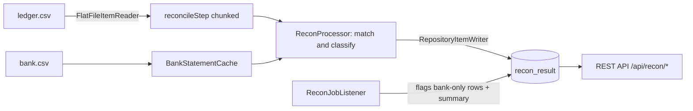

# ledger-recon

> Original work by **Sairaghav Udayagiri** ([@sudayagiri5](https://github.com/sudayagiri5)). Licensed under MIT, commit history verifies authorship.

A small, runnable **Spring Batch** reference implementation of a **transaction reconciliation pipeline**, the kind of financial-operations automation I build day to day. It ingests two independent transaction feeds (an internal ledger and an external bank statement), matches them, classifies every exception, and serves the results over a REST API.

> **Note:** This is an original reference project built from scratch with **synthetic data**. It contains no employer code or proprietary logic; it demonstrates the *patterns* behind production reconciliation work.

## Why reconciliation?

Reconciliation is one of the most common back-office problems in banking and fintech: two systems each think they know what happened, and someone has to prove they agree. By hand it doesn't scale. This project is the automated version (ingest, match, flag, report), built the way a resilient batch job should be.

## What it does

Every transaction lands in one of four buckets:

| Status | Meaning |
| --- | --- |
| `MATCHED` | In both feeds, amounts agree |
| `MISMATCH` | In both feeds, amounts differ (with the delta) |
| `MISSING_IN_BANK` | In the ledger, but the bank never reported it |
| `MISSING_IN_LEDGER` | The bank reported it, but it isn't in the ledger |

## Architecture



- **Reader** streams the ledger feed row by row (chunked, so it scales to large files).
- **Processor** looks each row up in the in-memory bank statement and classifies it.
- **Writer** persists results through Spring Data JPA.
- **Listener** records bank-only rows as `MISSING_IN_LEDGER` and logs a summary.
- **REST API** serves the summary and the exception list.

## Tech stack

Java 17 · Spring Boot 3 · Spring Batch · Spring Data JPA · Spring Web · H2 (default) / PostgreSQL · Maven

## Run it

```bash
mvn spring-boot:run
```

The job runs on startup and prints a summary:

```
=================== RECONCILIATION SUMMARY ===================
 Matched .................. 8
 Mismatched ............... 1
 Missing in bank .......... 1
 Missing in ledger ........ 2
 Total exceptions ......... 4
==============================================================
```

Then query the API:

```bash
curl http://localhost:8080/api/recon/summary
curl http://localhost:8080/api/recon/exceptions
curl -X POST http://localhost:8080/api/recon/run   # re-run on demand
```

Example exception payload:

```json
[
  { "txnId": "TXN-1006", "status": "MISMATCH", "ledgerAmount": 3300.50, "bankAmount": 3300.05, "difference": 0.45, "counterparty": "Umbrella Holdings" },
  { "txnId": "TXN-1008", "status": "MISSING_IN_BANK", "ledgerAmount": 540.00, "bankAmount": null, "difference": null, "counterparty": "Stark Industries" }
]
```

## Use PostgreSQL instead of H2

```yaml
spring:
  datasource:
    url: jdbc:postgresql://localhost:5432/recon
    username: recon
    password: recon
  jpa:
    hibernate:
      ddl-auto: update
```

Run with `mvn spring-boot:run -Dspring-boot.run.profiles=postgres`.

## Project layout

```
src/main/java/com/sudayagiri/ledgerrecon
├── LedgerReconApplication.java
├── config/BatchConfig.java        # job, step, reader, writer
├── batch/
│   ├── BankStatementCache.java    # loads the bank feed, tracks matches
│   ├── ReconProcessor.java        # match and classify
│   └── ReconJobListener.java      # bank-only rows + summary
├── model/                         # LedgerTxn, ReconResult, ReconStatus
├── repo/ReconResultRepository.java
└── web/ReconController.java       # REST endpoints
```

## Where this could go next

- Emit a Kafka event per exception so downstream systems react in real time.
- Schedule the job and alert when the exception count crosses a threshold.
- Add tolerance rules (round to cents, allow same-day timing differences).

## License

MIT © 2026 Sairaghav Udayagiri